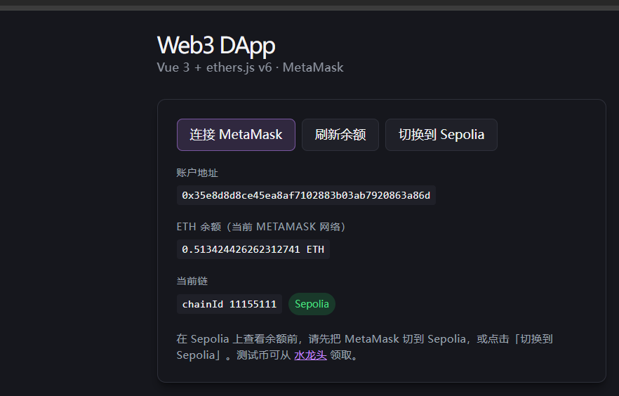
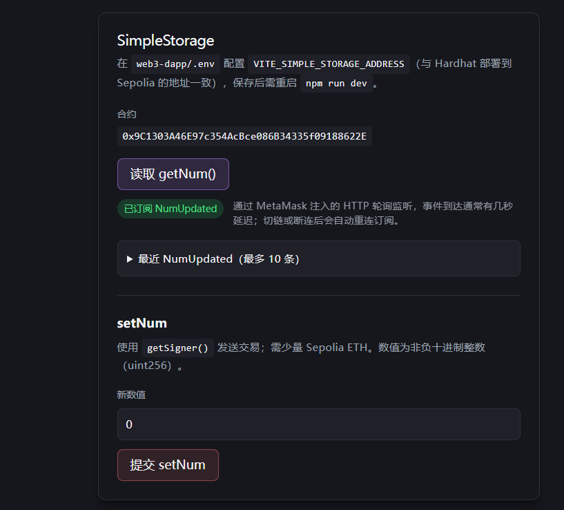
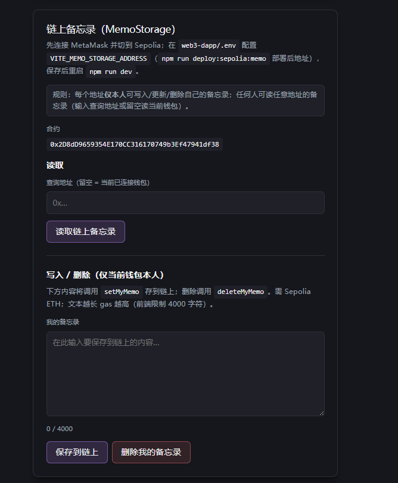
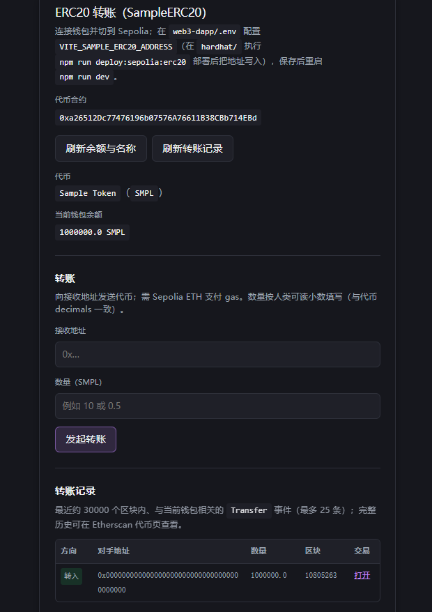
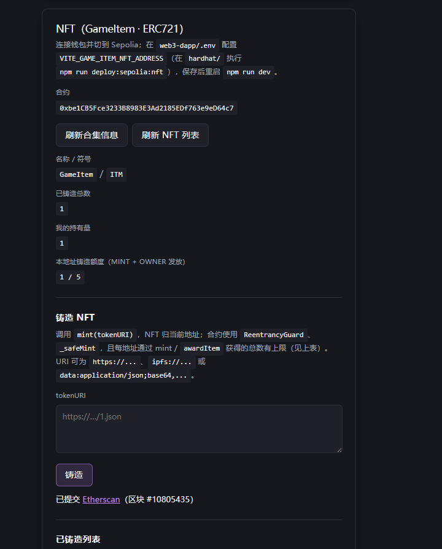
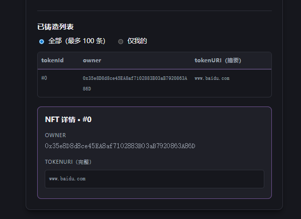
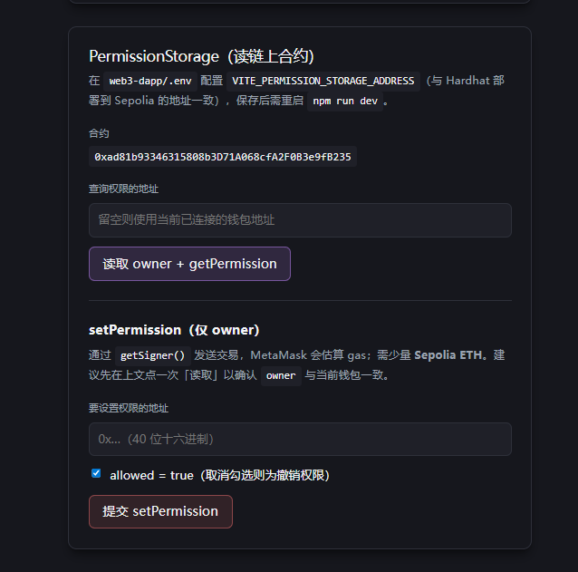
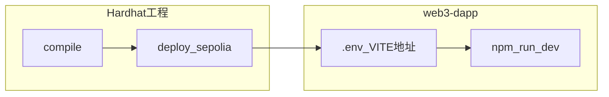

# web3-dapp

**Vue 3 + TypeScript + Vite + ethers.js v6**，通过浏览器 **MetaMask** 连接钱包，在 **Sepolia** 上与已部署合约交互。合约开发与部署在独立仓库 / 目录 **[Hardhat 工程](../hardhat/README.md)** 中完成。

---

## 技术栈

| 项 | 说明 |
|----|------|
| 框架 | [Vue 3](https://vuejs.org/)（`<script setup>`） |
| 构建 | [Vite 8](https://vitejs.dev/) |
| 链交互 | [ethers v6](https://docs.ethers.org/v6/) `BrowserProvider` / `Contract` |
| 钱包 | [MetaMask](https://metamask.io/)（`window.ethereum`，EIP-1193） |
| 目标网络 | **Sepolia**（`chainId` = `11155111`，与 `useWallet.ts` 中常量一致） |

---

## 环境要求

- **Node.js**：建议 18+
- **浏览器**：安装 MetaMask 扩展；页面使用 `http://localhost` 或 `https` 以便钱包注入脚本正常工作

---

## 快速开始

```bash
cd web3-dapp
npm install
```

1. 复制 **`.env.example`** 为 **`.env`**。
2. 将 Hardhat 部署到 Sepolia 后终端打印的合约地址填入对应 `VITE_*` 变量（见下表）。
3. 启动开发服务：

```bash
npm run dev
```

**重要**：修改 `.env` 后必须**重启** `npm run dev`，Vite 才会重新注入 `import.meta.env`。

---

## 环境变量（`.env`）

所有合约地址均为 **`0x` + 40 位十六进制**；留空或格式错误时，对应面板会提示未配置。

| 变量名 | 对应合约 / 功能 | Hardhat 部署命令（在 `hardhat/` 目录执行） |
|--------|-----------------|---------------------------------------------|
| `VITE_PERMISSION_STORAGE_ADDRESS` | `PermissionStorage` | `npm run deploy:sepolia:permission` |
| `VITE_SIMPLE_STORAGE_ADDRESS` | `SimpleStorage` | `npm run deploy:sepolia:simple` |
| `VITE_MEMO_STORAGE_ADDRESS` | `MemoStorage` | `npm run deploy:sepolia:memo` |
| `VITE_SAMPLE_ERC20_ADDRESS` | `SampleERC20` | `npm run deploy:sepolia:erc20` |
| `VITE_GAME_ITEM_NFT_ADDRESS` | `GameItem`（ERC721，源码见 `hardhat/contracts/ERC721URIStorage.sol`） | `npm run deploy:sepolia:nft` |

部署说明、RPC、私钥等见 **[../hardhat/README.md](../hardhat/README.md)**。

---

## npm scripts

| 命令 | 说明 |
|------|------|
| `npm run dev` | 启动 Vite 开发服务器（热更新） |
| `npm run build` | `vue-tsc -b` 类型检查 + `vite build` 生产构建 |
| `npm run preview` | 本地预览生产构建产物 |

---

## 目录结构（`src/`）

```
src/
├── App.vue                 # 根布局：钱包区 + 各合约面板
├── main.ts
├── vite-env.d.ts           # Vite 环境变量类型声明（VITE_*）
├── injectionKeys.ts        # provide/inject 钱包上下文 Key
├── abis/                   # 各合约 Human-Readable ABI 片段（与 Hardhat 合约接口对齐）
├── components/             # 按合约划分的 UI 面板
├── composables/            # useWallet、各合约读写逻辑
└── utils/                  # 如 ethers 交易错误格式化（用户拒签等）
```

---

## 钱包与网络（`useWallet.ts`）

- **连接**：`eth_requestAccounts`，使用 `ethers.BrowserProvider(window.ethereum)`。
- **静默恢复**：页面加载时 `eth_accounts` 无弹窗恢复已授权账户。
- **Sepolia**：`wallet_switchEthereumChain` / `wallet_addEthereumChain`（RPC 默认 `https://rpc.sepolia.org`，可在 composable 中按需调整）。
- **事件**：`accountsChanged`、`chainChanged` 时刷新 `provider` / `chainId` / 余额。

各合约 composable 通过 **`provide(WalletInjectionKey)`** 注入同一钱包状态；**必须在 `App.vue` 已 provide 之后**使用子 composable。

---

## 功能面板与合约对应关系

页面自上而下大致为：

| 组件 | 功能概要 | 主要 composable / ABI |
|------|----------|-------------------------|
| 顶部 **钱包卡片** | 连接 MetaMask、ETH 余额、`chainId`、切 Sepolia | `useWallet.ts` |
| `SimpleStoragePanel` | `getNum` / `setNum`，`tx.wait()` 与回执 | `useSimpleStorage.ts`，`NumUpdated` 事件订阅（HTTP 轮询延迟说明见 UI） |
| `MemoStoragePanel` | 链上备忘录读/写/删（每地址独立） | `useMemoStorage.ts` |
| `SampleErc20Panel` | 代币元数据、余额、`transfer`、`Transfer` 事件历史 | `useSampleErc20.ts` |
| `GameItemNftPanel` | NFT 铸造、列表、详情、铸造额度 | `useGameItemNft.ts` |
| `PermissionStoragePanel` | `getPermission` / `setPermission`（仅 owner 可写） | `usePermissionStorage.ts` |

区块浏览器链接统一使用 **Sepolia Etherscan**：`https://sepolia.etherscan.io/`。

---

## 界面演示截图

截图文件位于本仓库 **`docs/screenshots/`**（与 `README.md` 相对路径如下）。这样**单独克隆 `web3-dapp`、或在 GitHub 只浏览本仓库**时，Markdown 预览仍能加载图片。

若本地工作区与 `hardhat` 为同级目录，**Hardhat** 侧另有同内容副本：`hardhat/docs/dapp-screenshots/`（见 [Hardhat README](../hardhat/README.md) 中「前端联调演示截图」章节）。此前使用 `../hardhat/docs/...` 在「仅有 web3-dapp 仓库」时会找不到路径，导致裂图。

### 1. 钱包与网络



### 2. SimpleStorage



### 3. MemoStorage



### 4. ERC20 转账



### 5. GameItem 铸造



### 6. GameItem 列表与详情



### 7. PermissionStorage



---

## 与 Hardhat 仓库的协作流程



1. 在 `hardhat/` 配置 `.env`（RPC、私钥），编译并执行对应 `deploy:sepolia:*`。
2. 将输出的合约地址写入 `web3-dapp/.env` 的 `VITE_*`。
3. 在 `web3-dapp/` 运行 `npm run dev`，浏览器切到 **Sepolia**，连接与部署时**同一逻辑链**上的钱包进行交互。

---

## 常见问题

| 现象 | 处理建议 |
|------|----------|
| 修改 `.env` 后地址未生效 | 停止并重新执行 `npm run dev` |
| 提示非 Sepolia | 在页面点击「切换到 Sepolia」或在 MetaMask 中手动切换 |
| 交易报错一长串 JSON | 多为用户拒签；已用 `utils/ethersTxError.ts` 收敛为简短中文提示 |
| `GameItem` 面板读元数据失败 | 合约升级后需**重新部署**并更新 `VITE_GAME_ITEM_NFT_ADDRESS`；旧地址与新版 ABI 可能不匹配 |
| ERC20 / NFT 列表不完整 | 前端为控制 RPC 压力限制了查询区块范围或条数，完整历史请用 Etherscan |

---

## 延伸阅读

- [ethers v6 Contract](https://docs.ethers.org/v6/api/contract/)
- [Vite 环境变量与模式](https://vitejs.dev/guide/env-and-mode.html)
- [Vue 3 + TypeScript](https://vuejs.org/guide/typescript/overview.html)
